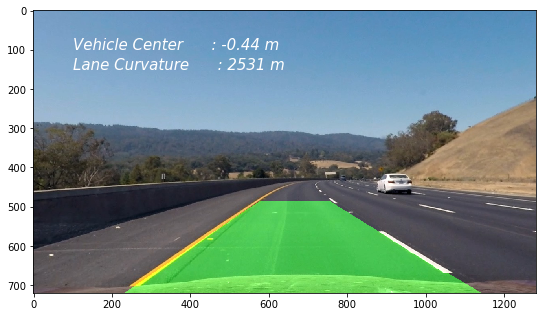

[//]: # (Image References)

[image1]: ./output_images/UNDIST_Image.png "Undistorted Image"
[image2]: ./output_images/PERSPECTIVE_image.png "Perspective Transform"
[image3]: ./output_images/L_CHANNEL_binary.png "L_CHANNEL_binary"
[image4]: ./output_images/B_CHANNEL_binary.png "B_CHANNEL_binary"
[image5]: ./output_images/COMBI_CHANNEL_binary.png "Combined Binary"
[image6]: ./output_images/WINDOW_poly.png "Polynomial Fit"
[image7]: ./output_images/DETECTED.png "Detected Lanes, Curvature and Vehicle Position"
[image9]: ./output_images/camera_calib.png "Camera Calibration"

## Advanced Lane Finding Project

This project involves building a image processing pipeline to detect road lanes form a center dash camera of a vehicle. In order to sucessfully detect the road lanes, the following steps are performed

- Compute the camera calibration matrix and distortion coefficients given a set of chessboard images.
- Apply a distortion correction to raw images.
- Apply a perspective transform to rectify binary image ("Top view of the road").
- Use color transforms, to create a thresholded binary image.
- Detect lane pixels and fit to find the lane boundary.
- Determine the curvature of the lane and vehicle position with respect to center.
- Warp the detected lane boundaries back onto the original image.
- Output visual display of the lane boundaries and numerical estimation of lane curvature and vehicle position.
 

## Organisation of the code

The juypter notebook "Advanced_Lane_Finding.ipynb" contains the implementation of building a pipeline for an image. This pipeline is transformed to python package "lanedetector" that supports implementing the pipeline on video files. The "lanedetector" package contains class defintion for laneDetector and Line.

### Find Chessboard Corners

Open CV image read function reads images in the RGB colour space as BGR numpy array. Open CV provides a function `cv2.findChessboardCorners()`, this function identifies the chessboard corners using the pin hole camera model. A `cv2.drawChessboardCorners()` function provide a visual identifier for all the corners detected by the camera. The given chessboard images contains a 9 x 6 matrix.

The code lines are found in cells 2, 3, 4, 5 and 7. Object points that represent the (x, y, z) co-ordinates in the real world, with z axis contains 0 length. The image points contains the array of detected corners.

![Chessboard Corners][image9]

### Undistort Image

The `objpoints` and `imgpoints` are used to compute the camera calibration and distortion coefficients using the `cv2.calibrateCamera()` function.  This distortion correction is applied to the test image using the `cv2.undistort()` function. The code lines are found in cells 8, 9 and 10.

![Undistort Image][image1]

### Perspective Transform

A perspective transform is applied in order to generate a top view a.k.a birds eye view of the road lanes. The region of interest for this pipeline are the vehicle lanes. Hence a specific region of the lanes are identified as source (`src`) and these are warped in to a destination (`dst`) region. The following are the source and destination of choice

| Source        | Destination   | 
|:-------------:|:-------------:| 
| 490, 480      | 0, 0          | 
| 810, 480      | 1280, 0       |
| 1250, 720     | 1250, 720     |
| 100, 720      | 100, 720      |

The open cv functions `cv2.getPerspectiveTransform` is used to generate the perpective transform and `cv2.warpPerspective` is used to generate the warped image. All these code are built in a function called `getperspective()`. The code lines are in cells 11, 12 and 13.

![Perspective transformed][image2]

### Colour transform and binary threshold

The pixels associated with lane lines have to be isolated to fit a polynomial of the curve. The colours of the lane lines can be isolated using different colourspace such as `HLS`, `LUV` and `Lab`. 
 - The image was converted to `Lab` colour space and by using the minimum threhold of 215 and maximum threshold of 255 the yellow line was efficiently isloated from the rest of the image. 
 
![B Channel][image4]
 
 - The `LUV` colourspace was efficient in isolating the white lanes efficiently with min and max threshold of 145 and 200 respectively. 
 
![L Channel][image3]

 - A combined binary image of the `LUV` and `Lab` colourspace of the image was able to isolate the lane line. The code lines are foudn in the cells 13 to 21.

![Combined Binary][image5]

### Detect lane-line pixels and fit their positions with a polynomial

The combined binary images was used to isolate the pixels assocaiated with left lane and right lane. This was achieved by the following steps,
 - Calculating the histogram of the pixles in the combined binary image.
 - Use a sliding window starting from the bottom of the image to find the position of peak of the histogram to isolate start point for left and right lane.
 - Identify all the non zero pixels within a given windows area using the `numpy.nonzero()` function and `append` it to a numpy array for left and right lane seperately.
 - A polynomial was fit to the left and right lane pixels using `numpy.polyfit()` function.
 
![Polynomial Fit][image6]

### Calculate radius of curvature of the lane & the position of the vehicle with respect to center.

The radius of curvature is calcuated using the formula `Radius of curvature R = ((1+(2Ay+B)^2)^3/2)/|2A|`, where A and B represents the co-efficents of the polynomial. 
 - The curvature has to be calculated in real world space. So a conversion factor 30 meters per 720 pixesl for y direction and 3.7 meters for 700 pixels in x direction was used.
 - The radius of curvature for left and right lane was calcuated seperately and averaged for resultant curvature of the lane.
 
 The vehicle postion was calculated based on the assumption, the camera is mounted on the center of the vehicle in x direction.
 - The mean of left lane and right lane center provides the lane center. The delta between the image center and lane center provide the offset of the vehicle to the lane `vehicle_pos = (img_center - lane_center) * xm_per_pix`. This was converted to real world space using the pixel per meter conversion.

### Warp Lane Lines and Curvature to Original Image
 
 The final step was to plot the polynomial determined in the warped image and fill the region between the lanes to represent the detected lane. The image was transformed back to undistored image using the inverse matrix of perspective transform. The image was annotated with the radius of curvature and vehicle postion per frame.

![Detected Lane][image7]

### Pipeline (video)

The process used for detecting the lanes and calculating the curvature information was transformed in to a python package. This has two class definition `laneDetector` and `Line`. 
 - A lane detector class contains the definition to perform camera calibration, image undistort, colourspace threshold calculation and the pipeline for fitting a polynomial.
 - The Line class definition carries the attribute of the given line per frame.
 - In order to create a smooth lane identification and transition between curve and straght scenarious the polynomial is averaged over the last n frames.
 - The pipeline identifies if the lane was detected in the previous frame and if detected using that as starting point to search for the lane pixels in the current frame using the `Line.searchfromexisting()` method. If the lane pixels are not identified, a moving window based `Line.fulllanesearch()` method is used.
 - In the pipeline an object for left lane and right lane was created induvidually to smooth the transition of the lanes while processing the video.

Here's a [link to my video result](./project_video_out.mp4)
 
 |						   Lane Detection with Curavture and Vehicle Position                            |
 |:-----------------------------------------------------------------------------------------------------:|
 ||
 |                       [Youtube Link](https://www.youtube.com/watch?v=3HQdlOwGI6k)                     |

### Areas of Weakness for the pipeline and robustness improvements

The lane detection pipeline works most of the time. The pipeline was able to estbalish the lane position for the project video.
 - In the challenge video the lane detection was smooth all through the video expect for the region at which the bridge appears and due to the intense shadow effect the warped perspective image lost the quality of lane. Hence further image augumentation is needed to improve the contrast if the lanes for the pipeline to identify the lanes perfectly.
 - Additional challenges would be to fine tune the lane detection pipeline to adverse weather conditions, using additional cameras to detect situations like u turns where one of the lanes can disappear due to field of view.
 - Better curve fitting function such as univariate spline or piecewise polynomials can be adapted for fitting the curve.

### Code Dependencies:
Python 3.5 and the following dependencies:
 - [NumPy](http://www.numpy.org/)
 - [matplotlib](http://matplotlib.org/)
 - [OpenCV](http://opencv.org/)
 - [MoviePy](http://zulko.github.io/moviepy/)
