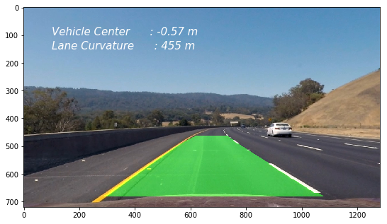

[//]: # (Image References)

[image1]: ./output_images/UNDIST_Image.png "Undistorted Image"
[image2]: ./output_images/PERSPECTIVE_image.png "Perspective Transform"
[image3]: ./output_images/L_CHANNEL_binary.png "L_CHANNEL_binary"
[image4]: ./output_images/B_CHANNEL_binary.png "B_CHANNEL_binary"
[image5]: ./output_images/COMBI_CHANNEL_binary.png "Combined Binary"
[image6]: ./output_images/WINDOW_poly.png "Polynomial Fit"
[image7]: ./output_images/DETECTED.png "Detected Lanes, Curvature and Vehicle Position"
[image9]: ./output_images/camera_calib.png "Camera Calibration"

## Advanced Lane Finding Project

This project involves building a image processing pipeline to detect road lanes form a center dash caemra of a vehicle. In order to sucessfully detect the road lanes, the following steps are performed

- Compute the camera calibration matrix and distortion coefficients given a set of chessboard images.
- Apply a distortion correction to raw images.
- Apply a perspective transform to rectify binary image ("Top view of the road").
- Use color transforms, to create a thresholded binary image.
- Detect lane pixels and fit to find the lane boundary.
- Determine the curvature of the lane and vehicle position with respect to center.
- Warp the detected lane boundaries back onto the original image.
- Output visual display of the lane boundaries and numerical estimation of lane curvature and vehicle position.
 

## Organisation of the code

The juypter notebook "Advanced_Lane_Finding.ipynb" contains the implementation of building a pipeline for an image. This pipeline is transformed to python package "lanedetector" that supports implementing the pipeline on video files. The "lanedetector" package contains class defintion for laneDetector and Line.

### Find Chessboard Corners

Open CV image read function reads images in the RGB colour space as BGR numpy array. Open CV provides a function `cv2.findChessboardCorners()`, this function identifies the chessboard corners using the pin hole camera model. A `cv2.drawChessboardCorners()` provide a visual indetifier for all the corners detected by the camera. The given chessboard images contains a 9 x 6 matrix.

The code lines are found in cells 2,3,4,5 and 7

Object points that represent the (x, y, z) co-ordinates in the real world, with z axis contains 0 length. the image points contains the array of detected corners.

![Chessboard Corners][image9]

### Undistort Image

The `objpoints` and `imgpoints` to compute the camera calibration and distortion coefficients using the `cv2.calibrateCamera()` function.  I applied this distortion correction to the test image using the `cv2.undistort()` function. The code lines are found in cells 8, 9 and 10.

![Undistort Image][image1]

### Perspective Transform

A perspective transform is applied in order to generate a top view a.k.a birds eye view of the road lanes. The region of interest for this pipeline are the vehicle lanes. Hence a specific region of the lanes are identified as source (`src`) and these are warped in to a destination (`dst`) region. the following are the source and destination of choice

| Source        | Destination   | 
|:-------------:|:-------------:| 
| 490, 480      | 0, 0          | 
| 810, 480      | 1280, 0       |
| 1250, 720     | 1250, 720     |
| 100, 720      | 100, 720      |

The open cv functions `cv2.getPerspectiveTransform` is used to generate the perpective transform and `cv2.warpPerspective` is used to generate the warped image. All these code are built in a function called `getperspective()`. The code lines are in cells 11, 12 and 13.

![Perspective transformed][image2]

### Colour transform and binary threshold

The pixels associated with lane lines have to be isolated to detect the lanes better. The colours of the lane lines can be isolated using different colourspace such as `HLS`, `LUV` and `Lab`. The image was converted to `Lab` colour space and by using the right amount of threshold values the yellow line was efficiently isloated from the rest of the image. 
 
![B Channel][image4]
 
 The `LUV` colourspace was efficient in isolating the white lanes efficiently. 
 
![L Channel][image3]

 A combined binary image of the `LUV` and `LAB` colourspace of the image was able to isolate the lane line. The code lines are the cells 13 to 21.

![Combined Binary][image5]

### Detect lane-line pixels and fit their positions with a polynomial

Then I did some other stuff and fit my lane lines with a 2nd order polynomial kinda like this:

![Polynomial Fit][image6]

### Calculate radius of curvature of the lane & the position of the vehicle with respect to center.

I did this in lines # through # in my code in `my_other_file.py`

### Warp Lane Lines and Curvature to Original Image

![Detected Lane][image7]

### Pipeline (video)

#### 1. Provide a link to your final video output.  Your pipeline should perform reasonably well on the entire project video (wobbly lines are ok but no catastrophic failures that would cause the car to drive off the road!).

Here's a [link to my video result](./project_video_out.mp4)
 
 |						   Lane Detection with Curavture and Position                                    |
 |:-----------------------------------------------------------------------------------------------------:|
 ||
 |                       [Youtube Link](https://www.youtube.com/watch?v=3HQdlOwGI6k)                     |

### Challenge Video

### Areas of Weakness for the pipeline and robustness improvements

Here I'll talk about the approach I took, what techniques I used, what worked and why, where the pipeline might fail and how I might improve it if I were going to pursue this project further.  
